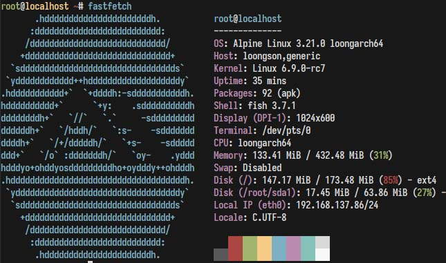

在龙芯久久派上启动 Alpine 3.21 / Launching Alpine 3.21 on Loongarch 99 pi



## 如何构建？ / How to build?

确保 Podman 可用 / Make sure Podman is available

```bash
./make_rootfs.sh
./make_img.sh
```

## 如何烧录？ / How to burn?

Linux 下： / Under Linux:

```bash
dd if=./image.img of=/dev/${Your_USB_Disk} bs=4M
```

Windows 下，使用 rufus 等软件进行烧录。/ For Windows, use software like rufus to burn.

## 如何引导？ / How to boot?

请确保久久派的 Uboot 可用。 / Ensure that Uboot is available for 99 Pi。

在 Uboot 命令行下： / At the Uboot command line:

### TF 卡版本 / TF-card version

```
fatload usb 0:1 0x9000000004000000 /uImage-tfcard
setenv bootargs root=/dev/sda2 rootfstype=ext4 rootwait rw rootdelay=5 init=/sbin/init console=ttyS0,115200
bootm 0x9000000004000000
```

### wifi 版本（手上没板子，未测试）/ wifi version (not tested)

```
fatload usb 0:1 0x9000000004000000 /uImage-wifi
setenv bootargs root=/dev/sda2 rootfstype=ext4 rootwait rw rootdelay=5 init=/sbin/init console=ttyS0,115200
bootm 0x9000000004000000
```

## 启动系统后的注意事项 / Tips after booting the system

### 如何扩展根分区？ / How to extend the root partition?

进入 Alpine 后，执行： / After entering Alpine, run:

```bash
growpart /dev/sda 2
resize2fs /dev/sda2
```
